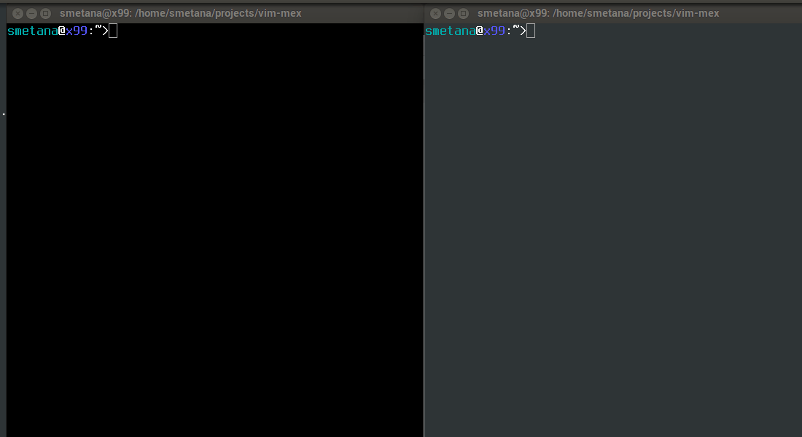

vim-mex

Vim plugin to expand Elixir macros

Prerequisites
-------------
* Vim
* Elixir
* Screen
* vim-slime plugin for Vim https://github.com/jpalardy/vim-slime
* Mex https://github.com/mrluc/mex

Usage
-----

* Start screen session with -c mex.screenrc
* Select code in vim (visual)
* <C-c><C-e>

Demo
----

